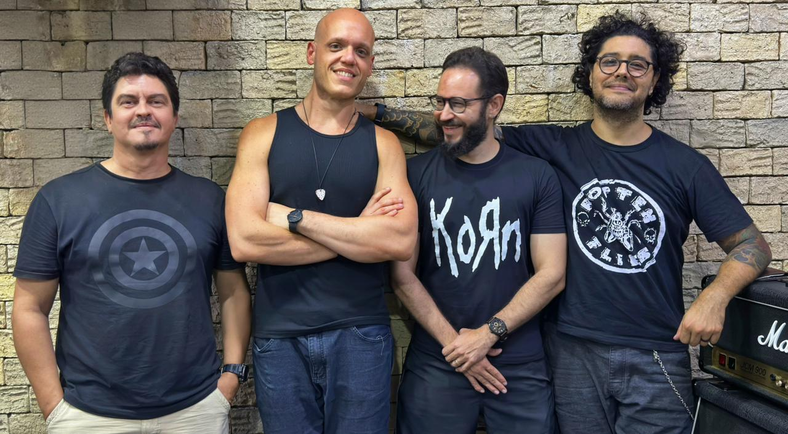

  

---

**Omni Type** é uma banda paraibana que transita entre o rock e o metal sem se limitar a rótulos ou estilos definidos. Para o grupo, a música é um território de exploração constante — cada composição representa uma oportunidade de desbravar novas sonoridades, mesclando influências diversas e construindo algo genuinamente único.

O projeto teve início em 2018 com cinco integrantes e, ao longo dos anos, passou por transformações naturais até se consolidar com dois dos membros fundadores, responsáveis por manter viva a essência criativa da banda. Essa caminhada foi marcada por pausas, retomadas e por um vasto acervo de composições que permaneceram guardadas por anos, à espera do momento certo para finalmente ganhar forma e voz.

Em 2024, impulsionada pelo novo fôlego da cena do rock paraibano, a banda retomou suas atividades com mais maturidade artística e uma identidade musical bem definida, adotando oficialmente o nome **Omni Type**. O resultado desse renascimento se materializa no lançamento do primeiro EP em 2025, um trabalho que resgata músicas compostas nos primeiros anos da banda — verdadeiras “fitas demo” modernas, repletas de energia, nostalgia e personalidade.

Após o lançamento do EP, a banda passou novamente por mudanças em sua formação, incorporando mais dois integrantes. Essa nova configuração ampliou o campo sonoro do grupo, agregando novas influências, novas ideias e novas possibilidades criativas às composições.

Mais do que uma banda de rock ou metal, a **Omni Type** se apresenta como uma experiência sonora que combina peso, melodia e liberdade criativa, refletindo sua trajetória, suas transformações e sua busca constante por identidade musical.

---

## 👥 Membros da Banda

- **Aylan Cavalcanti** – Vocal e Guitarra
- **João Abrantes** – Guitarra
- **Joas Pedroza** - Baixo
- **Eiji Kumamoto** – Bateria

---

## 🎤 Press Kit – Omni Type

📸 **[Fotos oficiais](https://drive.google.com/drive/folders/1h8MC_LHb6-f4yI1NluQXp0AADuM9uTiS?usp=drive_link)**

🎧 **Streaming**

- [Spotify](https://open.spotify.com/intl-pt/artist/1SsgzkYScPAA5t2yhZ0W5N?si=L8-Lu9RXSbGK8llhllAVTg)
- [YouTube](https://www.youtube.com/channel/UC-_VMnFe-ZhuXP83EaotwsQ)
- [Deezer](https://www.deezer.com/en/artist/196550597)
- [Apple Music](https://music.apple.com/br/album/my-old-tapes-vol-1-ep/1826901884)
- [Amazon Music](https://music.amazon.com.br/artists/B0BRYK4N1K/omni-type)

📱 **Redes Sociais**

- [Instagram](https://www.instagram.com/omnitypeband/)

📩 **Contato**

- **E-mail:** [omnitypeband@gmail.com](mailto:omnitypeband@gmail.com)

---
